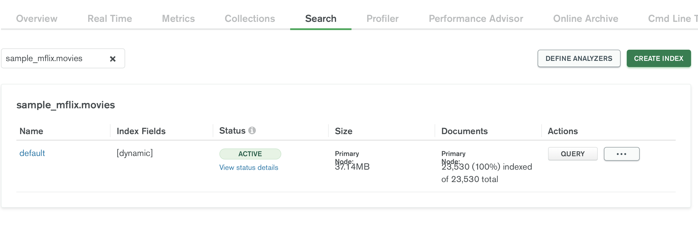
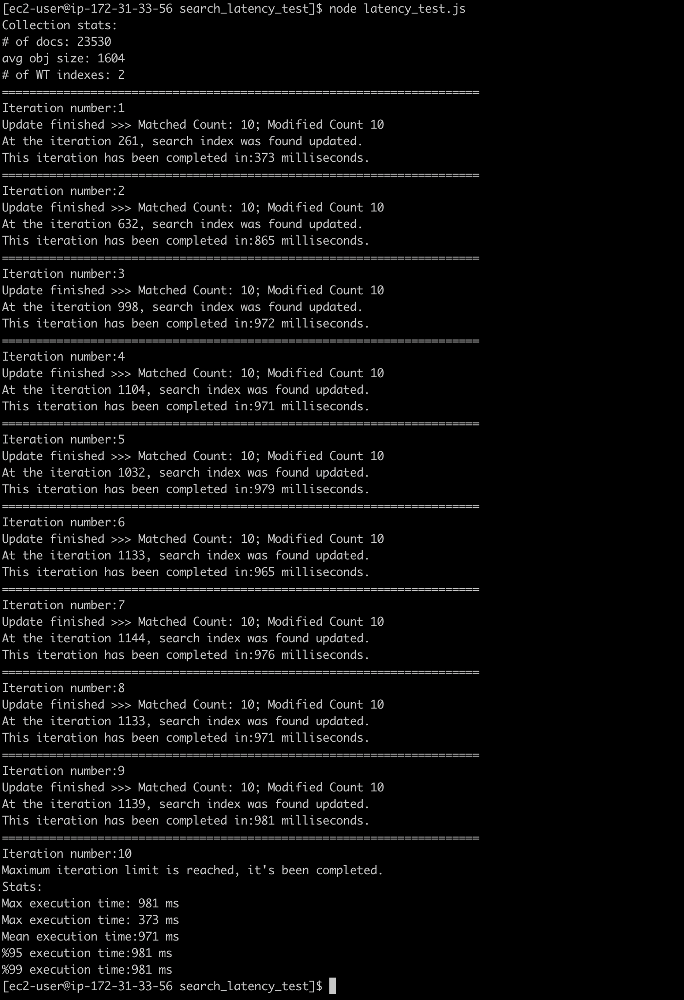

# Atlas Search Index Latency Test

In this toolkit, you can test the approximate latency of Lucene index update. 

In contrast to [regular indexes](https://docs.mongodb.com/manual/indexes/) ([Wired Tiger](https://docs.mongodb.com/manual/core/wiredtiger/) Indexes) in MongoDB, Lucene search indexes are asynchronously updated. Therefore, you might see stale data, if you immediately query just after you've written. 

## Where It was Tested

- It's been tested succesfully on Amazon Linux 2, with the node version `v17.1.0`  and npm version `8.1.2`. 

## Installing

- After you've successfully installed `node` and `npm` on the machine, clone this repository and run the following command to install dependent libraries
  - `npm install`

## Preparing Atlas Cluster and Search Index

- Provision an M30 Atlas Cluster in the region closest to the location where the script is going to be executed.
- [Load Sample Data](https://docs.atlas.mongodb.com/sample-data/) into the cluster. 
- Create a [dynamic index](https://docs.atlas.mongodb.com/reference/atlas-search/tutorial/create-index-ui/) on the collection `movies` in the `sample_mflix` database. Result should be similar to below.

## Modifying Connection String

- Change the `connectionString` variable in the `latency_test.js`  accordingly.

## How the Test Works

- In every step script generates a random string and updates a field in the collection and that field is also in the search index. 
  - Depends on the variable `numberOfUpdatesPerIteration` , 1 or more documents can be updated.
  - `_id` fields of the updated documents were stored temporarily. 
- After `updateMany` successfully executed, `$search` query executed with the `phrase` search to match generated random string. 
  - `$search` query is executed until it returns all the updated documents in the `updateMany` stage. 

## Running the Test

- Locate the folder where the script in place
- Run the following:
  - `node latency_test.js`

#### Observing Results

- After you run you will see the similar output as below.
- 

#### How to Customize This Script

- Change the db/collection name accordingly in the config part of the script
- Change the index name and field to be updated properly. 
- You can update multiple fields rather than one field as in this script and re-evaluate the latency values
- This is only one single thread therefore you can run multiple node process concurrently and re-evaluate the latency values
- If you increase number of updates per iteration, you may see higher latencies.
  - e.g. `var numberOfUpdatesPerIteration=1000`

